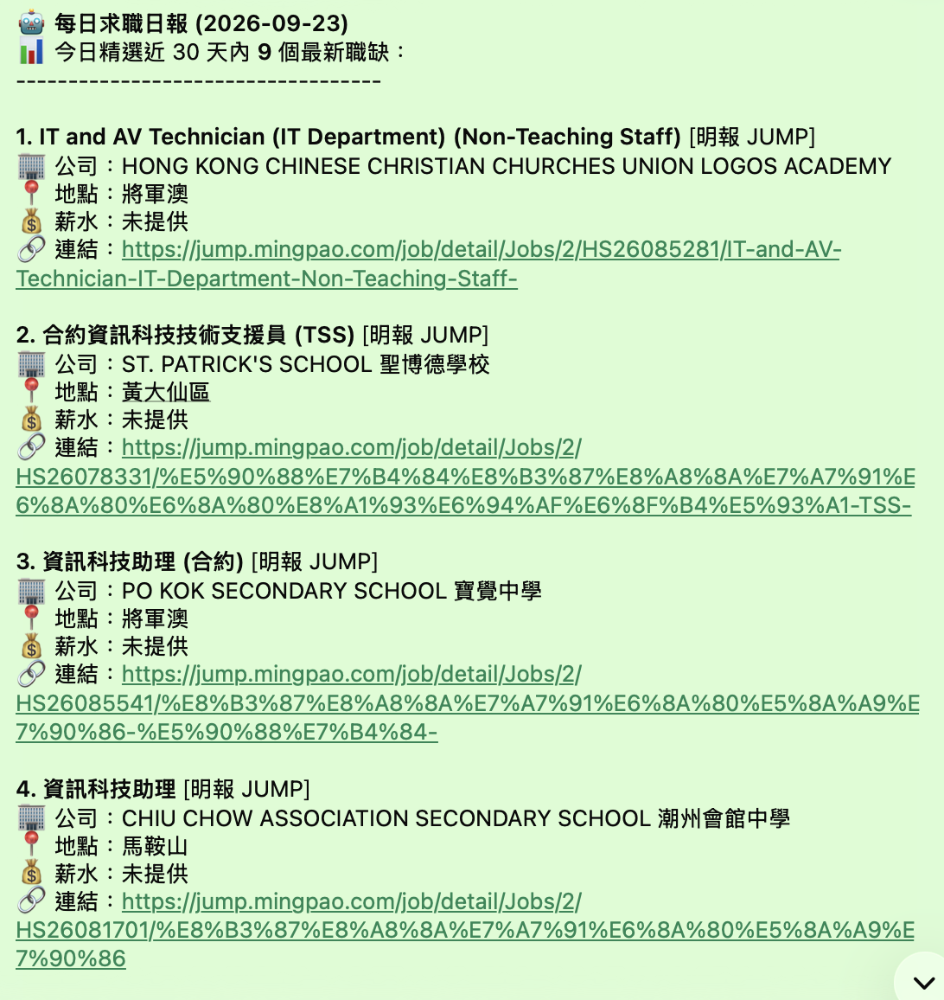
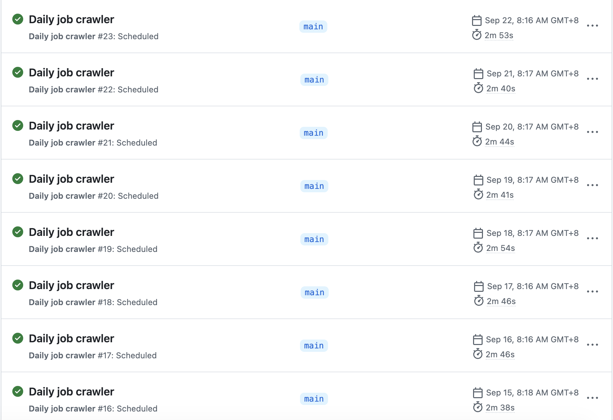

# Daily Job Intelligence Automation

An automated job-monitoring pipeline that collects relevant vacancies, processes
JobsDB email alerts and Ming Pao JUMP listings, and delivers a structured daily
report through WhatsApp.

> **Status:** Working prototype in daily operation  
> **Role:** Personal project — design, development, integration and deployment

## Project Outcome

The workflow runs automatically every morning and turns vacancies from multiple
sources into one concise report containing the job title, company, location,
available salary information and application link.

### WhatsApp report



The report provides a mobile-friendly shortlist, allowing vacancies to be reviewed
without repeatedly visiting multiple job platforms.

### Scheduled automation



GitHub Actions provides unattended daily execution. The run history above shows
multiple consecutive successful scheduled runs at approximately 08:00 HKT.

## Problem

Reviewing several job platforms every day is repetitive. Direct automated access
to some platforms is also unreliable because of bot protection. This project uses
official JobsDB job-alert emails as a stable input and combines them with publicly
available listings from Ming Pao JUMP.

## Solution Architecture

```text
JobsDB saved searches
        │
        v
Gmail job-alert emails ──> Gmail API (read-only) ──┐
                                                   ├─> Parse and filter
Ming Pao JUMP listings ──> Web extraction ─────────┘         │
                                                             v
                                                   Remove sent links
                                                             │
                                                             v
                                                   WhatsApp daily report

                 GitHub Actions schedules and runs the pipeline
```

## Key Features

- Reads the previous day's JobsDB alerts through the Gmail API.
- Extracts each JobsDB card as a separate job title, company, location and optional
  salary record.
- Collects school IT vacancies from Ming Pao JUMP.
- Supports data, financial-data, quantitative and school-IT search themes.
- Applies school and IT-title checks to broad searches to reduce irrelevant results.
- Identifies more specific Hong Kong districts where listing data permits.
- Avoids resending previously reported job links.
- Sends a formatted WhatsApp report through Green API.
- Runs unattended through GitHub Actions.
- Keeps credentials in encrypted GitHub Actions repository secrets.

## Search Themes

- Data Analyst and Data Operations
- Automation Specialist
- Quantitative Analyst
- Financial Data Analyst
- Quant Developer
- Financial Data Engineer
- School IT Assistant, IT Technician and TSS roles

## Technology Stack

| Area | Technology |
|---|---|
| Language | Python 3.12 |
| Email integration | Gmail API, OAuth 2.0 |
| Data extraction | Requests, BeautifulSoup, Selenium fallback |
| Automation | GitHub Actions |
| Delivery | Green API / WhatsApp |
| State management | JSON sent-job history |

## Reliability and Data Quality

- Each JobsDB email card is parsed independently to prevent values leaking between
  neighbouring vacancies.
- Salary is displayed only when an explicit and plausible salary format is present;
  otherwise the report shows `未提供` (not provided).
- Scheduled runs may begin later than the requested time when GitHub-hosted runners
  are busy.
- Extraction rules can be updated if an email or website changes its HTML structure.

## Security and Privacy

- Gmail access uses the `gmail.readonly` OAuth scope.
- The application cannot send, delete, modify or mark Gmail messages as read.
- API credentials and OAuth tokens are not stored in source code.
- Runtime credentials are provided through encrypted GitHub Actions secrets.
- Phone numbers, email addresses, browser profiles and live credentials are excluded
  from this public case study.

See the [Privacy Policy](PRIVACY.md) for further details.

## Future Improvements

- Add automated parser tests using anonymised email samples.
- Rank vacancies by keyword relevance and preferred districts.
- Add structured logging and failure notifications.
- Build a dashboard for search performance and application tracking.
- Move job history to a managed database if the dataset grows.

## Repository Note

This repository is the public case study and privacy-information page. The live
automation repository remains private because it contains operational configuration
and personal job-search history.
